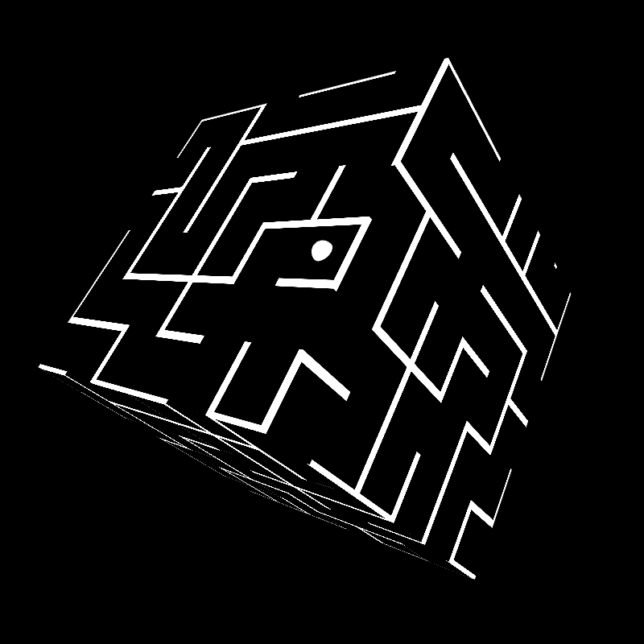

# Hey There! 👋

Welcome to my Portfolio!
 
I'm Jon Gardner,

I have 10 years experience as a full stack interactive 3D and game programmer. I specialise in gameplay system architecture and high performance C#. I also enjoy working on low level networking, backend servers, designer tooling, and just about any problem that needs solving; I’m a jack of all trades!

### Contents
- [Hey There! 👋](#hey-there-)
    - [Contents](#contents)
  - [Projects:](#projects)

## Projects:

I'm perpetually working on projects and finding new problems to hack at. **I live and breathe C#**

- Here's a few old ones that I think are neat.

|  |   |
| :----------------------: | :-: |
|  | 
**Lovac** is a personal favourite of mine; A 2D top-down ASCII space shoot-em-up, centered around collecting modules to expand your ship
 |
|  | 
**CubeMaze** is a simple maze game wrapped around a cube. While it's another example of an odd mesh I've had to generate at runtime, I think the much more intresting aspect is the maze generation itself.
 |

<!--
**Jonathan-Gardner/Jonathan-Gardner** is a ✨ _special_ ✨ repository because its `README.md` (this file) appears on your GitHub profile.

Here are some ideas to get you started:

- 🔭 I’m currently working on ...
- 🌱 I’m currently learning ...
- 👯 I’m looking to collaborate on ...
- 🤔 I’m looking for help with ...
- 💬 Ask me about ...
- 📫 How to reach me: ...
- 😄 Pronouns: ...
- ⚡ Fun fact: ...
-->
